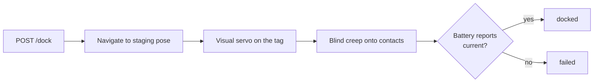

# Docking

The robot docks itself on its charger using the rear camera and an AprilTag on the dock
face. No line-following, no infrared beacons, no floor markers.

## How a dock runs



1. **Staging** — navigate to a standoff pose in front of the dock, facing away from it.
2. **Visual servo** — reverse while continuously steering to keep the tag centred, so the
   robot arrives square rather than merely nearby. Approaching in a straight line from a
   slightly wrong angle is how a robot ends up inclined against the funnel instead of
   seated in it.
3. **Blind creep** — for the last few centimetres the tag is too close for the camera to
   see. The robot commits to a slow straight reverse, having earned the right to by being
   aligned when it lost sight.
4. **Confirm** — success is the battery reporting current flow.

!!! danger "Success means charging"
    Not arriving. Not stopping. A robot that has stalled against the dock's edge has
    arrived and stopped, and is not charging. The only evidence of contact is current.

---

### <span class="verb post">POST</span> `/dock`

Initiate autonomous docking onto the charging station using AprilTag visual servoing.

#### Request
- **Method**: `POST`
- **Path**: `/dock`
- **Headers**: `Content-Type: application/json`

**Payload:**

| Field | Type | Required | Description |
|---|---|---|---|
| `navigate_to_staging` | `boolean` | Optional | If `true` (default), navigates to staging pose before visual servoing. Set `false` only if already facing dock. |

```json
{
  "navigate_to_staging": true
}
```

#### Response
- **Status**: <span class="status warn">202 Accepted</span>

```json
{
  "accepted": true,
  "navigate_to_staging": true
}
```

| Field | Type | Description |
|---|---|---|
| `accepted` | `boolean` | `true` when docking sequence has been scheduled |
| `navigate_to_staging` | `boolean` | Echo of staging flag used |

#### Error Codes

| Status | Code | Cause / Resolution |
|---|---|---|
| <span class="status err">409</span> | `dock_busy` | A dock or undock operation is already in progress |
| <span class="status err">503</span> | `action_unavailable` | The docking controller node is not running |

#### Example (cURL)

```bash
curl -s -X POST $ROBOT/dock \
     -H 'Content-Type: application/json' \
     -d '{"navigate_to_staging": true}'
```

---

### <span class="verb post">POST</span> `/undock`

Back clear off the charging contacts and stop stationary.

#### Request
- **Method**: `POST`
- **Path**: `/undock`
- **Headers**: None required
- **Payload**: None

#### Response
- **Status**: <span class="status warn">202 Accepted</span>

```json
{
  "accepted": true
}
```

| Field | Type | Description |
|---|---|---|
| `accepted` | `boolean` | `true` when undock movement begins |

#### Error Codes

| Status | Code | Cause / Resolution |
|---|---|---|
| <span class="status err">409</span> | `dock_busy` | A dock or undock is already running |
| <span class="status err">503</span> | `action_unavailable` | Docking controller node is not running |

#### Example (cURL)

```bash
curl -s -X POST $ROBOT/undock
```

---

### <span class="verb get">GET</span> `/dock/status`

Dock controller state, AprilTag visibility, and physical battery charging status.

#### Request
- **Method**: `GET`
- **Path**: `/dock/status`
- **Headers**: None required
- **Payload**: None

#### Response
- **Status**: <span class="status ok">200 OK</span>

```json
{
  "state": "charging",
  "operation": "docked",
  "message": "",
  "charging": true,
  "battery_status": "full",
  "tag_visible": false
}
```

| Field | Type | Description |
|---|---|---|
| `state` | `string` | State reported by docking controller |
| `operation` | `string` | High-level status: `idle`, `docking`, `undocking`, `docked`, `undocked`, `failed` |
| `message` | `string` | Failure cause if operation is `failed` |
| `charging` | `boolean` | **Ground truth**: `true` when electrical charging current flows through contacts |
| `battery_status` | `string` | BMS state (`charging`, `full`, `discharging`, `not_charging`, `unknown`) |
| `tag_visible` | `boolean` | `true` if dock AprilTag is visible in camera frame |

#### Error Codes

| Status | Code | Cause / Resolution |
|---|---|---|
| <span class="status err">401</span> | `unauthorized` | Token authentication enabled and Bearer token missing/invalid |

#### Example (cURL)

```bash
curl -s $ROBOT/dock/status
```

---

### <span class="verb get">GET</span> `/dock/pose`

Get map coordinates of the dock's staging and entry point.

#### Request
- **Method**: `GET`
- **Path**: `/dock/pose`
- **Headers**: None required
- **Payload**: None

#### Response
- **Status**: <span class="status ok">200 OK</span>

```json
{
  "data": { "x": 0.0, "y": 0.0, "theta": 0.0, "frame": "map" },
  "age_sec": 120.5
}
```

| Field | Type | Description |
|---|---|---|
| `data.x`, `data.y` | `number` | Dock map coordinates in metres |
| `data.theta` | `number` | Heading pointing outward from dock face |
| `data.frame` | `string` | Target frame (`map`) |

#### Error Codes

| Status | Code | Cause / Resolution |
|---|---|---|
| <span class="status err">404</span> | `no_dock_pose` | No dock pose has been configured or recorded yet |

#### Example (cURL)

```bash
curl -s $ROBOT/dock/pose
```

---

### <span class="verb put">PUT</span> `/dock/pose`

Configure or calibrate the map coordinates of the charging dock.

#### Request
- **Method**: `PUT`
- **Path**: `/dock/pose`
- **Headers**: `Content-Type: application/json`

**Payload:**

| Field | Type | Required | Description |
|---|---|---|---|
| `x`, `y` | `number` | Yes | Map-frame coordinates of the dock in metres |
| `theta` | `number` | Optional | Heading pointing **out** from dock face (default: `0.0`) |

```json
{
  "x": 0.0,
  "y": 0.0,
  "theta": 0.0
}
```

#### Response
- **Status**: <span class="status ok">200 OK</span>

```json
{
  "x": 0.0,
  "y": 0.0,
  "theta": 0.0
}
```

| Field | Type | Description |
|---|---|---|
| `x`, `y`, `theta` | `number` | Saved dock coordinates and approach orientation |

#### Error Codes

| Status | Code | Cause / Resolution |
|---|---|---|
| <span class="status err">400</span> | `missing_field` | `x` or `y` is missing |

#### Example (cURL)

```bash
curl -s -X PUT $ROBOT/dock/pose \
     -H 'Content-Type: application/json' \
     -d '{"x": 0.0, "y": 0.0, "theta": 0.0}'
```

!!! tip "The easy way to set this"
    Start mapping with the robot already docked. The map origin then *is* the dock, and no
    dock pose needs setting at all.

    Otherwise: dock the robot manually, run
    `POST /waypoints {"name": "charger", "type": "dock"}` to capture the pose, then PUT
    those coordinates here. Getting `theta` backwards is the common mistake — it points the
    way a docked robot faces, which is *away* from the dock.

This pose only needs to be roughly right. It determines where the staging approach ends;
from there the AprilTag takes over and does the precision work.

---

## When docking fails

| Symptom | Usual cause |
|---|---|
| `operation: failed` immediately | Docking controller not running, or no dock pose |
| Robot never leaves | Not localized — staging navigation cannot plan |
| Arrives but never contacts | Dock pose is off by more than the funnel can absorb |
| Contacts but no charge | Dirty contacts, or the dock is not powered |
| Fails only sometimes | Tag partly obscured, or strong backlight behind the dock |

`GET /dock/status` with `tag_visible` is the fastest way to split "cannot see the dock"
from "cannot reach the dock" — and those two have completely different fixes.
