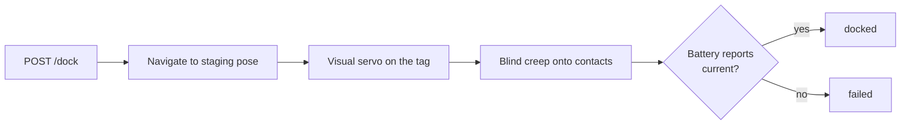

# Docking

The robot docks itself on its charger using the rear camera and an AprilTag on the dock
face. No line-following, no infrared beacons, no floor markers.

## How a dock runs



1. **Staging** — navigate to a standoff pose in front of the dock, facing away from it.
2. **Visual servo** — reverse while continuously steering to keep the tag centred, so the
   robot arrives square rather than merely nearby. Approaching in a straight line from a
   slightly wrong angle is how a robot ends up inclined against the funnel instead of
   seated in it.
3. **Blind creep** — for the last few centimetres the tag is too close for the camera to
   see. The robot commits to a slow straight reverse, having earned the right to by being
   aligned when it lost sight.
4. **Confirm** — success is the battery reporting current flow.

!!! danger "Success means charging"
    Not arriving. Not stopping. A robot that has stalled against the dock's edge has
    arrived and stopped, and is not charging. The only evidence of contact is current.

---

### <span class="verb post">POST</span> `/dock`

```bash
curl -s -X POST $ROBOT/dock
```

```json
{ "accepted": true, "navigate_to_staging": true }
```

| Field | Default | Notes |
|---|---|---|
| `navigate_to_staging` | `true` | Set `false` only when the robot is already parked in front of the dock |

**Responses**

| | When |
|---|---|
| <span class="status warn">202</span> | Docking started |
| <span class="status err">409 `dock_busy`</span> | A dock or undock is already running |
| <span class="status err">503 `action_unavailable`</span> | The docking controller is not running |

A full dock from across a room takes tens of seconds to a couple of minutes. Watch
`GET /dock/status` — or subscribe to the `dock_status` [stream](events.md) — until
`charging` is `true`.

`navigate_to_staging: false` skips straight to the visual servo. Use it only when the robot
is genuinely in front of the dock and can see the tag; from anywhere else it will search,
fail, and leave the robot somewhere unhelpful.

---

### <span class="verb post">POST</span> `/undock`

```bash
curl -s -X POST $ROBOT/undock
```

```json
{ "accepted": true }
```

Drives clear of the charging contacts and **stops**. It does not navigate anywhere
afterwards.

!!! tip "You rarely need this"
    [`POST /navigation/goto`](navigation.md) undocks first, automatically. Call `/undock`
    only when you want the robot off the charger and stationary — before manual teleop, or
    to stop charging.

That "and stops" is deliberate. An earlier design read an empty undock request as "undock,
then navigate to the origin". On a map built while docked, the origin *is* the dock — so
the robot would leave the charger and immediately circle back to it. An undock with no
destination now means exactly what it says.

---

### <span class="verb get">GET</span> `/dock/status`

```bash
curl -s $ROBOT/dock/status
```

```json
{ "state": "charging",
  "operation": "docked",
  "message": "",
  "charging": true,
  "battery_status": "full",
  "tag_visible": false }
```

| Field | Meaning |
|---|---|
| `state` | What the docking controller reports |
| `operation` | What the SDK last started: `idle`, `docking`, `undocking`, `docked`, `undocked`, `failed` |
| `message` | Failure reason when `operation` is `failed` |
| `charging` | **Battery current is flowing.** Ground truth |
| `battery_status` | `charging`, `full`, `discharging`, `not_charging`, `unknown` |
| `tag_visible` | The rear camera can currently see the dock's tag |

!!! info "The fields can disagree, legitimately"
    A robot pushed onto its dock by hand reports `charging: true` while `operation` is
    still `undocked` — nobody ran a docking operation, but it is charging. Conversely a
    dock that ended in `failed` may still be `charging` if it made contact on the way to
    giving up.

    For "is it physically on the charger?", read `charging`. For "did my dock command
    work?", read `operation`. They answer different questions.

`tag_visible: false` during the final approach is expected — the tag goes out of frame in
the last few centimetres. `tag_visible: false` at the *start* of a dock means the robot
cannot see its dock at all, which is the usual cause of a dock that never begins.

---

### <span class="verb get">GET</span> `/dock/pose`

Where the robot believes its dock is.

```bash
curl -s $ROBOT/dock/pose
```

```json
{ "data": { "x": 0.0, "y": 0.0, "theta": 0.0, "frame": "map" }, "age_sec": 120.5 }
```

<span class="status err">404 `no_dock_pose`</span> when no dock pose is known.

---

### <span class="verb put">PUT</span> `/dock/pose`

```bash
curl -s -X PUT $ROBOT/dock/pose -H 'Content-Type: application/json' \
     -d '{"x": 0.0, "y": 0.0, "theta": 0.0}'
```

```json
{ "x": 0.0, "y": 0.0, "theta": 0.0 }
```

| Field | Required | Notes |
|---|---|---|
| `x`, `y` | yes | Map-frame position of the dock |
| `theta` | no | Heading pointing **out** of the dock face — the direction a docked robot faces |

!!! tip "The easy way to set this"
    Start mapping with the robot already docked. The map origin then *is* the dock, and no
    dock pose needs setting at all.

    Otherwise: dock the robot manually, run
    `POST /waypoints {"name": "charger", "type": "dock"}` to capture the pose, then PUT
    those coordinates here. Getting `theta` backwards is the common mistake — it points the
    way a docked robot faces, which is *away* from the dock.

This pose only needs to be roughly right. It determines where the staging approach ends;
from there the AprilTag takes over and does the precision work.

---

## When docking fails

| Symptom | Usual cause |
|---|---|
| `operation: failed` immediately | Docking controller not running, or no dock pose |
| Robot never leaves | Not localized — staging navigation cannot plan |
| Arrives but never contacts | Dock pose is off by more than the funnel can absorb |
| Contacts but no charge | Dirty contacts, or the dock is not powered |
| Fails only sometimes | Tag partly obscured, or strong backlight behind the dock |

`GET /dock/status` with `tag_visible` is the fastest way to split "cannot see the dock"
from "cannot reach the dock" — and those two have completely different fixes.
