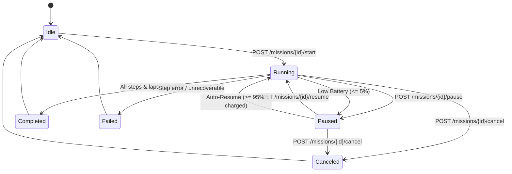

# Missions

A mission is a stored sequence of steps executed autonomously on the robot: navigating to
waypoints, waiting, docking, undocking, invoking ROS 2 services, sending ROS 2 action goals,
or firing outbound HTTP webhooks. Missions persist on the robot and can be looped or
triggered on a recurring [schedule](schedules.md).



---

### <span class="verb get">GET</span> `/missions`

List all stored missions configured on the robot.

#### Request
- **Method**: `GET`
- **Path**: `/missions`
- **Headers**: None required
- **Payload**: None

#### Response
- **Status**: <span class="status ok">200 OK</span>

```json
{
  "missions": [
    {
      "id": "morning-patrol",
      "name": "Morning patrol",
      "steps": [
        { "type": "navigate", "target": "kitchen" },
        { "type": "dock" }
      ],
      "loop_count": 2,
      "loop_forever": false
    }
  ],
  "count": 1
}
```

| Field | Type | Description |
|---|---|---|
| `missions` | `array` | List of mission objects stored on the robot |
| `count` | `integer` | Total number of saved missions |

#### Error Codes

| Status | Code | Cause / Resolution |
|---|---|---|
| <span class="status err">500</span> | `internal_error` | Failed to read missions from internal disk storage |

#### Example (cURL)

```bash
curl -s $ROBOT/missions
```

---

### <span class="verb post">POST</span> `/missions`

Create or replace a multi-step autonomous mission.

#### Request
- **Method**: `POST`
- **Path**: `/missions`
- **Headers**: `Content-Type: application/json`

**Payload:**

| Field | Type | Required | Description |
|---|---|---|---|
| `id` | `string` | Yes | Unique mission identifier (slug format, e.g. `morning-patrol`) |
| `name` | `string` | Optional | Display name (defaults to `id`) |
| `steps` | `array` | Yes | Non-empty list of mission step objects |
| `loop_count` | `integer` | Optional | Repetition count (default: `1`) |
| `loop_forever` | `boolean` | Optional | If `true`, repeats indefinitely until canceled (default: `false`) |

```json
{
  "id": "morning-patrol",
  "name": "Morning patrol",
  "loop_count": 2,
  "steps": [
    { "type": "navigate", "target": "kitchen" },
    { "type": "wait", "duration": 10.0 },
    { "type": "navigate", "x": 2.1, "y": -0.4, "theta": 1.57 },
    { "type": "dock" }
  ]
}
```

#### Response
- **Status**: <span class="status ok">201 Created</span> (new) or <span class="status ok">200 OK</span> (overwritten)

```json
{
  "mission": {
    "id": "morning-patrol",
    "name": "Morning patrol",
    "steps": [
      { "type": "navigate", "target": "kitchen" },
      { "type": "wait", "duration": 10.0 },
      { "type": "navigate", "x": 2.1, "y": -0.4, "theta": 1.57 },
      { "type": "dock" }
    ],
    "loop_forever": false,
    "loop_count": 2
  }
}
```

| Field | Type | Description |
|---|---|---|
| `mission` | `object` | Stored mission configuration record |
| `mission.id` | `string` | Unique mission identifier |
| `mission.name` | `string` | Mission label |
| `mission.steps` | `array` | Complete list of defined step objects |
| `mission.loop_count` | `integer` | Number of loops configured |
| `mission.loop_forever` | `boolean` | Indefinite execution flag |

#### Error Codes

| Status | Code | Cause / Resolution |
|---|---|---|
| <span class="status err">400</span> | `invalid_field` | Missing `id` or `steps`, or invalid `loop_count` |
| <span class="status err">400</span> | `invalid_step` | A step is malformed, missing required fields, or specifies an unresolvable ROS service/action type |

#### Example (cURL)

```bash
curl -s -X POST $ROBOT/missions \
     -H 'Content-Type: application/json' \
     -d '{
       "id": "morning-patrol",
       "name": "Morning patrol",
       "loop_count": 2,
       "steps": [
         { "type": "navigate", "target": "kitchen" },
         { "type": "wait", "duration": 10 },
         { "type": "dock" }
       ]
     }'
```

---

### <span class="verb get">GET</span> `/missions/{id}`

Retrieve a single saved mission definition by its unique identifier.

#### Request
- **Method**: `GET`
- **Path**: `/missions/{id}`
- **URL Parameters**:

| Parameter | Type | Required | Description |
|---|---|---|---|
| `id` | `string` | Required | Unique mission identifier |

- **Headers**: None required
- **Payload**: None

#### Response
- **Status**: <span class="status ok">200 OK</span>

```json
{
  "mission": {
    "id": "morning-patrol",
    "name": "Morning patrol",
    "steps": [
      { "type": "navigate", "target": "kitchen" },
      { "type": "dock" }
    ],
    "loop_count": 2,
    "loop_forever": false
  }
}
```

| Field | Type | Description |
|---|---|---|
| `mission` | `object` | The stored mission configuration |
| `mission.id` | `string` | Unique mission ID |
| `mission.name` | `string` | Display label |
| `mission.steps` | `array` | Sequential steps |
| `mission.loop_count` | `integer` | Configured repeat loops |
| `mission.loop_forever` | `boolean` | Indefinite execution state |

#### Error Codes

| Status | Code | Cause / Resolution |
|---|---|---|
| <span class="status err">404</span> | `mission_not_found` | No mission exists with the given `id` |

#### Example (cURL)

```bash
curl -s $ROBOT/missions/morning-patrol
```

---

### <span class="verb delete">DELETE</span> `/missions/{id}`

Delete a saved mission by ID from disk.

#### Request
- **Method**: `DELETE`
- **Path**: `/missions/{id}`
- **URL Parameters**:

| Parameter | Type | Required | Description |
|---|---|---|---|
| `id` | `string` | Required | Unique mission identifier |

- **Headers**: None required
- **Payload**: None

#### Response
- **Status**: <span class="status ok">200 OK</span>

```json
{
  "deleted": true,
  "id": "morning-patrol"
}
```

| Field | Type | Description |
|---|---|---|
| `deleted` | `boolean` | `true` when mission was removed |
| `id` | `string` | Echo of deleted mission identifier |

#### Error Codes

| Status | Code | Cause / Resolution |
|---|---|---|
| <span class="status err">404</span> | `mission_not_found` | No mission exists with the specified `id` |
| <span class="status err">409</span> | `mission_active` | Cannot delete a mission while it is currently running or paused |

#### Example (cURL)

```bash
curl -s -X DELETE $ROBOT/missions/morning-patrol
```

---

### <span class="verb post">POST</span> `/missions/{id}/start`

Execute a saved mission. Requires the robot to be in **navigation mode**.

#### Request
- **Method**: `POST`
- **Path**: `/missions/{id}/start`
- **URL Parameters**:

| Parameter | Type | Required | Description |
|---|---|---|---|
| `id` | `string` | Required | Unique mission identifier |

- **Headers**: None required
- **Payload**: None

#### Response
- **Status**: <span class="status warn">202 Accepted</span>

```json
{
  "started": true,
  "id": "morning-patrol",
  "steps_count": 4,
  "loop_count": 2
}
```

| Field | Type | Description |
|---|---|---|
| `started` | `boolean` | `true` when execution begins |
| `id` | `string` | Mission identifier |
| `steps_count` | `integer` | Number of steps in the sequence |
| `loop_count` | `integer` | Total laps to execute |

#### Error Codes

| Status | Code | Cause / Resolution |
|---|---|---|
| <span class="status err">404</span> | `mission_not_found` | Mission ID does not exist |
| <span class="status err">409</span> | `mission_already_running` | Another mission is already active |
| <span class="status err">409</span> | `not_in_navigation_mode` | Robot must be in navigation mode before starting |

#### Example (cURL)

```bash
curl -s -X POST $ROBOT/missions/morning-patrol/start
```

---

### <span class="verb post">POST</span> `/missions/{id}/pause`

Pause an in-progress mission. Cancels the active Nav2 navigation goal or direct motion, leaving the robot stationary while preserving execution state.

#### Request
- **Method**: `POST`
- **Path**: `/missions/{id}/pause`
- **URL Parameters**:

| Parameter | Type | Required | Description |
|---|---|---|---|
| `id` | `string` | Required | Unique mission identifier |

- **Headers**: None required
- **Payload**: None

#### Response
- **Status**: <span class="status ok">200 OK</span>

```json
{
  "paused": true,
  "id": "morning-patrol",
  "step_index": 1,
  "reason": "user"
}
```

| Field | Type | Description |
|---|---|---|
| `paused` | `boolean` | `true` when mission is paused |
| `id` | `string` | Mission identifier |
| `step_index` | `integer` | Current step index where pause occurred |
| `reason` | `string` | Reason string (`"user"`) |

#### Error Codes

| Status | Code | Cause / Resolution |
|---|---|---|
| <span class="status err">404</span> | `mission_not_found` | No mission with this ID exists |
| <span class="status err">409</span> | `mission_not_running` | Mission is not in `running` state |

#### Example (cURL)

```bash
curl -s -X POST $ROBOT/missions/morning-patrol/pause
```

---

### <span class="verb post">POST</span> `/missions/{id}/resume`

Resume a previously paused mission from the exact step and lap where it was paused.

#### Request
- **Method**: `POST`
- **Path**: `/missions/{id}/resume`
- **URL Parameters**:

| Parameter | Type | Required | Description |
|---|---|---|---|
| `id` | `string` | Required | Unique mission identifier |

- **Headers**: None required
- **Payload**: None

#### Response
- **Status**: <span class="status ok">200 OK</span>

```json
{
  "resumed": true,
  "id": "morning-patrol",
  "step_index": 1
}
```

| Field | Type | Description |
|---|---|---|
| `resumed` | `boolean` | `true` when execution resumes |
| `id` | `string` | Mission identifier |
| `step_index` | `integer` | Index of the step resuming execution |

#### Error Codes

| Status | Code | Cause / Resolution |
|---|---|---|
| <span class="status err">404</span> | `mission_not_found` | No mission with this ID exists |
| <span class="status err">409</span> | `mission_not_paused` | Mission is not in `paused` state |

#### Example (cURL)

```bash
curl -s -X POST $ROBOT/missions/morning-patrol/resume
```

---

### <span class="verb post">POST</span> `/missions/{id}/cancel`

Cancel active mission execution completely. Cancels underlying Nav2 goals, halts motion, and transitions state to `canceled`.

#### Request
- **Method**: `POST`
- **Path**: `/missions/{id}/cancel`
- **URL Parameters**:

| Parameter | Type | Required | Description |
|---|---|---|---|
| `id` | `string` | Required | Unique mission identifier |

- **Headers**: None required
- **Payload**: None

#### Response
- **Status**: <span class="status ok">200 OK</span>

```json
{
  "canceled": true,
  "id": "morning-patrol"
}
```

| Field | Type | Description |
|---|---|---|
| `canceled` | `boolean` | `true` when mission is terminated |
| `id` | `string` | Mission identifier |

#### Error Codes

| Status | Code | Cause / Resolution |
|---|---|---|
| <span class="status err">404</span> | `mission_not_found` | No mission with this ID exists |
| <span class="status err">409</span> | `mission_not_active` | Mission is neither `running` nor `paused` |

#### Example (cURL)

```bash
curl -s -X POST $ROBOT/missions/morning-patrol/cancel
```

---

### <span class="verb get">GET</span> `/missions/status`

Current execution telemetry and step-level progress of the active mission runner.

#### Request
- **Method**: `GET`
- **Path**: `/missions/status`
- **Headers**: None required
- **Payload**: None

#### Response
- **Status**: <span class="status ok">200 OK</span>

```json
{
  "mission_id": "morning-patrol",
  "state": "running",
  "status": "running",
  "step_index": 2,
  "loop_index": 0,
  "loop_total": 2,
  "message": "",
  "pause_reason": null,
  "elapsed_sec": 47.3
}
```

| Field | Type | Description |
|---|---|---|
| `mission_id` | `string \| null` | Active mission identifier (or `null` when idle) |
| `state` | `string` | Runner lifecycle state: `idle`, `running`, `paused`, `completed`, `failed`, or `canceled` |
| `status` | `string` | Compatibility alias of `state` |
| `step_index` | `integer` | 0-based index of the currently executing step |
| `loop_index` | `integer` | 0-based lap counter |
| `loop_total` | `integer \| null` | Total planned laps (`null` when `loop_forever: true`) |
| `pause_reason` | `string \| null` | Reason for pause: `"user"`, `"low_battery"`, or `null` |
| `message` | `string` | Status message or error description on failure |
| `elapsed_sec` | `number` | Seconds elapsed since the mission started |

#### Error Codes

| Status | Code | Cause / Resolution |
|---|---|---|
| <span class="status err">401</span> | `unauthorized` | Token authentication enabled and Bearer token missing/invalid |

#### Example (cURL)

```bash
curl -s $ROBOT/missions/status
```

---

## Step Types Reference

Every step in a mission must declare a `"type"` string matching one of the supported actions:

| Step Type | Required Fields | Description |
|---|---|---|
| `navigate` | `waypoint` or `target` **or** `x`/`y` | Nav2 autonomous traversal to a named waypoint or map coordinate |
| `wait` | `duration` or `duration_sec` | Pauses robot execution for a fixed number of seconds |
| `dock` | — | Autonomous AprilTag visual servoing onto the charging station |
| `undock` | — | Disengages from charging contacts and reverses clear of dock |
| `call_service` | `service`, `service_type` | Synchronous invocation of any advertised ROS 2 service |
| `call_action` | `action`, `action_type` | Asynchronous dispatch of a ROS 2 Action goal with progress tracking |
| `call_api` | `url` | Outbound HTTP/HTTPS webhook call to external web/cloud endpoints |

---

### 1. `navigate` — Waypoint & Pose Navigation

Routes the robot using the autonomous Nav2 navigation stack with dynamic obstacle avoidance.

```json
{
  "type": "navigate",
  "target": "inspection_bay"
}
```

- **`target`** or **`waypoint`** *(string)*: Named waypoint from the active map.
- **`x`**, **`y`** *(numbers, optional)*: Explicit coordinates in metres (if target is omitted).
- **`theta`** *(number, optional)*: Final orientation in radians (default: `0.0`).

---

### 2. `wait` — Timed Pause

Halts execution for a set duration before proceeding to the next step.

```json
{
  "type": "wait",
  "duration": 10.0
}
```

- **`duration`** or **`duration_sec`** *(number, required)*: Pause duration in seconds.

---

### 3. `dock` and `undock` — Charger Lifecycle

Autonomous docking via rear-camera AprilTag detection and contact engagement.

```json
{
  "type": "dock",
  "navigate_to_staging": true
}
```

- **`navigate_to_staging`** *(boolean, optional)*: If `true` (default), navigates to staging pose before servoing.

---

### 4. `call_service` — ROS 2 Service Invocations

Executes a synchronous request/response call to any ROS 2 service advertised in the robot's local graph. Useful for triggering hardware sensors, relays, costmap clearing, or camera captures.

```json
{
  "type": "call_service",
  "service": "/camera/capture_snapshot",
  "service_type": "std_srvs/srv/Trigger",
  "request": {},
  "timeout": 10.0,
  "ignore_error": false
}
```

- **`service`** *(string, required)*: Fully qualified ROS 2 service name.
- **`service_type`** *(string, required)*: ROS 2 interface type (e.g. `std_srvs/srv/Trigger`). Verified at save time.
- **`request`** *(object, optional)*: Payload dictionary matching service Request fields.
- **`timeout`** *(number, optional)*: Maximum wait duration in seconds (default: `15.0`).
- **`ignore_error`** *(boolean, optional)*: If `true`, a failure logs a warning and continues rather than aborting.

---

### 5. `call_action` — ROS 2 Action Invocations

Dispatches a goal to any ROS 2 Action server and tracks its feedback and completion. Useful for specialized movements (spins, lifts, arm trajectories).

```json
{
  "type": "call_action",
  "action": "/spin",
  "action_type": "nav2_msgs/action/Spin",
  "goal": {
    "target_yaw": 3.14159
  },
  "timeout": 30.0,
  "ignore_error": false
}
```

- **`action`** or **`action_name`** *(string, required)*: ROS 2 action server name.
- **`action_type`** *(string, required)*: ROS 2 interface type (e.g. `nav2_msgs/action/Spin`). Verified at save time.
- **`goal`** *(object, optional)*: Goal fields matching Action definition.
- **`timeout`** *(number, optional)*: Action completion timeout in seconds (default: `300.0`).
- **`ignore_error`** *(boolean, optional)*: Continue mission even if action fails.

---

### 6. `call_api` — Outbound Webhooks & Cloud Integration

Fires an HTTP/HTTPS request to an external server or manufacturing execution system (MES) directly from the robot.

```json
{
  "type": "call_api",
  "url": "https://mes.internal/inspections",
  "method": "POST",
  "headers": {
    "X-API-Key": "secret-mes-key",
    "Content-Type": "application/json"
  },
  "payload": {
    "station": "inspection_bay",
    "status": "arrived"
  },
  "timeout": 10.0,
  "ignore_error": true
}
```

- **`url`** *(string, required)*: Target HTTP/HTTPS endpoint.
- **`method`** *(string, optional)*: HTTP method: `"POST"` (default), `"GET"`, `"PUT"`, `"PATCH"`, or `"DELETE"`.
- **`headers`** *(object, optional)*: Key-value dictionary of HTTP headers.
- **`payload`** *(object or string, optional)*: Body sent with POST/PUT requests.
- **`timeout`** *(number, optional)*: HTTP request timeout in seconds (default: `15.0`).
- **`ignore_error`** *(boolean, optional)*: Continue mission if remote server returns an error.

---

## Mission Examples

### Complete Multi-Step Mission (JSON)

An end-to-end industrial inspection cycle combining navigation, camera snapshot service, MES cloud notification, spin maneuver, and auto-docking:

```json
{
  "id": "full-cycle-inspection",
  "name": "Warehouse Inspection with MES Webhook and High-Res Snapshot",
  "loop_count": 1,
  "steps": [
    {
      "type": "navigate",
      "target": "inspection_bay"
    },
    {
      "type": "call_service",
      "service": "/camera/capture_highres",
      "service_type": "std_srvs/srv/Trigger",
      "timeout": 10.0
    },
    {
      "type": "call_api",
      "url": "https://mes.internal/inspections",
      "method": "POST",
      "headers": { "X-API-Key": "secret-mes-key" },
      "payload": { "station": "inspection_bay", "result": "ready" },
      "ignore_error": true
    },
    {
      "type": "wait",
      "duration": 5.0
    },
    {
      "type": "call_action",
      "action": "/spin",
      "action_type": "nav2_msgs/action/Spin",
      "goal": { "target_yaw": 3.14159 },
      "timeout": 20.0
    },
    {
      "type": "dock",
      "navigate_to_staging": true
    }
  ]
}
```

---

### Python SDK Usage Example

Programmatically defining, saving, and executing a multi-step mission using the `navpromini` Python SDK:

```python
from navpromini import NavProMini

robot = NavProMini("192.168.1.50")

# Define mission steps
steps = [
    {"type": "navigate", "target": "station_a"},
    {
        "type": "call_service",
        "service": "/sensor_relay/trigger",
        "service_type": "std_srvs/srv/Trigger",
        "timeout": 5.0
    },
    {
        "type": "call_api",
        "url": "http://192.168.1.100:8080/events/arrival",
        "method": "POST",
        "payload": {"status": "arrived"},
        "ignore_error": False
    },
    {"type": "dock"}
]

# Save and execute
robot.save_mission("station_a_patrol", steps=steps, loop_count=1)
robot.start_mission("station_a_patrol", wait=True)
print("Mission successfully completed!")
```

---

## Low Battery Auto-Dock and Auto-Resume

During mission execution, the robot continuously monitors battery state of charge (SoC):

- **Trigger Threshold**: When battery SoC drops to $\le 5.0\%$ (configurable via `NAVPRO_LOW_BATT_DOCK_PCT`), the runner intercepts execution:
  1. Active navigation goals are smoothly canceled.
  2. Mission state transitions to `paused` with `pause_reason: "low_battery"`.
  3. The robot commands an auto-dock sequence to return to the charging station.
  4. Emits a WebSocket event `mission.paused` with `{"reason": "low_battery"}`.
- **Charging and Auto-Resume**:
  - The robot stays parked on the dock while recharging.
  - When battery SoC reaches $\ge 95.0\%$ (configurable via `NAVPRO_RESUME_BATT_PCT`), the robot automatically executes an undock maneuver and resumes the mission from the exact step and lap where it was paused.
  - Emits a WebSocket event `mission.resumed` with `{"reason": "battery_charged"}`.

### Edge Case Handling

| Scenario | Behavior |
|---|---|
| **User cancels while charging** | If `POST /missions/{id}/cancel` is called while parked on the charger, the mission terminates cleanly. **The robot stays safely docked and continues charging.** |
| **Manual resume override** | If `POST /missions/{id}/resume` is invoked while parked on the dock before 95% charge is reached, the robot immediately undocks and resumes with current charge. |
| **Docking failure on low battery** | If auto-docking fails or gets obstructed, the robot stops immediately, preserves mission pause state, and reports `pause_reason: "low_battery"` with an error message rather than endlessly looping. |
| **Normal user pause** | Manual pauses set `pause_reason: "user"` and do not initiate automatic docking or automatic resume. |

---

## Missions and the app

The NavPro Mini app's own Mission Planner is a client of this exact API, not a separate
system — a mission created from the app shows up here, and one created with `curl` shows up
in the app.
