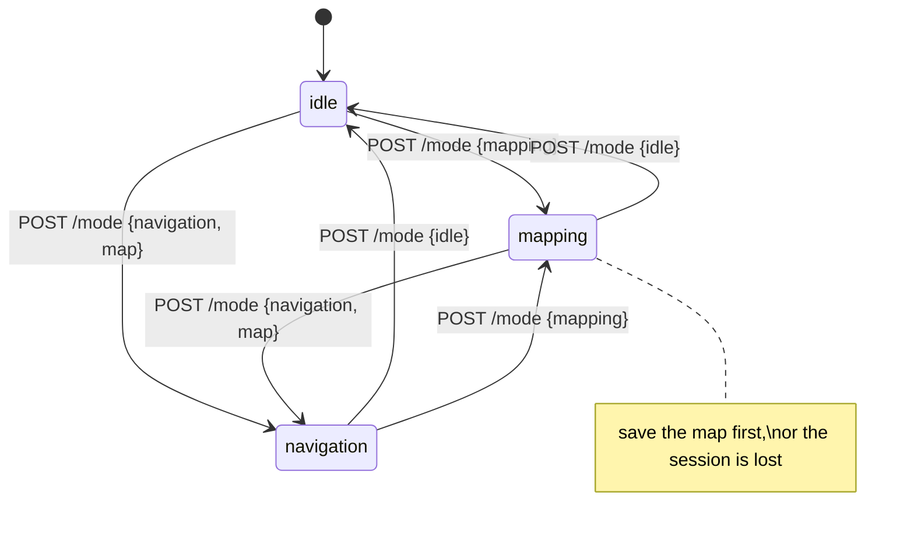

# Mode

The robot is in exactly one of three modes, and the mode decides which other endpoints do
anything useful.

| Mode | What runs | Enables |
|---|---|---|
| `idle` | Drivers only | Telemetry, [direct motion](motion.md), [docking](docking.md) |
| `mapping` | SLAM | Building and [saving a map](maps.md) |
| `navigation` | Nav2 + AMCL | [Localizing, goals, waypoints](navigation.md) |

!!! info "Why mapping and navigation cannot both run"
    Both publish the `map → odom` coordinate transform. Two publishers of the same
    transform make the robot's idea of where it is non-deterministic — it would flicker
    between two answers, and everything downstream would inherit the flicker. So a mode
    change always stops the current mode before starting the next.

---

### <span class="verb get">GET</span> `/mode`

```json
{ "mode": "navigation",
  "map": "workRoom",
  "launch_id": "3f2a9c1e-7b40-4d2a-9c33-8a1f6b0e5d77",
  "since_sec": 42.1 }
```

| Field | Meaning |
|---|---|
| `mode` | `idle`, `mapping` or `navigation` |
| `map` | Map in use — `null` outside navigation |
| `launch_id` | Handle for the underlying process group; useful in bug reports |
| `since_sec` | Seconds in this mode |

---

### <span class="verb post">POST</span> `/mode`

```json
{ "mode": "navigation", "map": "workRoom" }
```

| Field | Required | Notes |
|---|---|---|
| `mode` | yes | `idle`, `mapping` or `navigation` |
| `map` | for `navigation` | Omit to reuse the last activated map |

=== "Start navigation"

    ```bash
    curl -s -X POST $ROBOT/mode -H 'Content-Type: application/json' \
         -d '{"mode": "navigation", "map": "workRoom"}'
    ```

    ```json
    { "mode": "navigation", "map": "workRoom", "launch_id": "3f2a9c1e-…" }
    ```

=== "Start mapping"

    ```bash
    curl -s -X POST $ROBOT/mode -H 'Content-Type: application/json' \
         -d '{"mode": "mapping"}'
    ```

    Mapping always begins from a blank map. Save what it builds with
    [`POST /maps`](maps.md).

=== "Stop everything"

    ```bash
    curl -s -X POST $ROBOT/mode -H 'Content-Type: application/json' \
         -d '{"mode": "idle"}'
    ```

    ```json
    { "mode": "idle" }
    ```

**Responses**

| | When |
|---|---|
| <span class="status ok">200</span> | Switched to `idle` — nothing left to start |
| <span class="status warn">202</span> | Mode is starting; poll `GET /mode` |
| <span class="status err">400 `invalid_mode`</span> | Not one of the three |
| <span class="status err">400 `map_required`</span> | `navigation` with no map, and none previously activated |
| <span class="status err">409 `mode_busy`</span> | Another mode change is already in progress |
| <span class="status err">500 `launch_failed`</span> | The underlying stack refused to start |

## Timing

A mode change takes **several seconds** — Nav2 and SLAM each bring up a dozen nodes. The
call returns as soon as the launch is accepted, not when the stack is ready.

After switching to navigation, expect a short window where `/state/pose` still reports the
`odom` frame. That is normal: AMCL has not converged yet. Send
[`POST /navigation/localize`](navigation.md) to tell it roughly where the robot is, then
wait for `localized: true` before sending goals.



!!! danger "Leaving mapping discards the map"
    Switching out of mapping mode without calling [`POST /maps`](maps.md) throws away
    everything that session built. There is no recovery — the pose graph lives in the SLAM
    process, and stopping the mode stops the process.

## Who else can change the mode

The NavProMini app changes modes through the same mechanism, so a mode change from the app
is visible here and vice versa. There is exactly one owner of the mapping and navigation
launches, by design; two owners would reintroduce the double-transform hazard from a
different direction.

One consequence worth knowing: the robot stack normally shuts down mapping and navigation
when the last app disconnects. The SDK holds that connection open for as long as it owns a
running mode, so a mode you started through the API survives closing the app.
