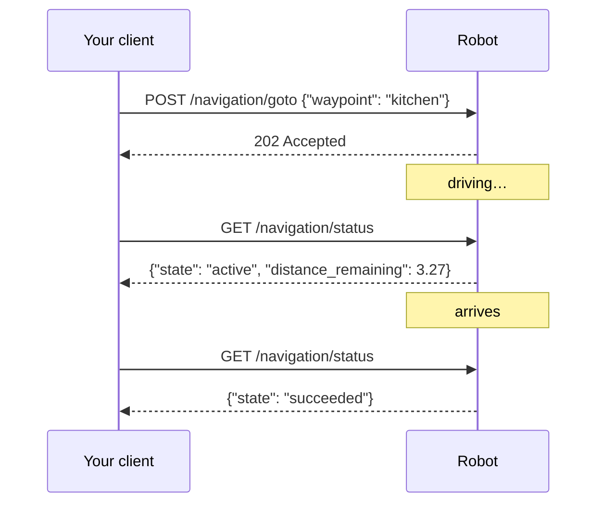

# Core concepts

Six ideas cover almost everything that surprises people integrating with a mobile robot
for the first time.

## Modes are exclusive

The robot is in exactly one of three modes:

| Mode | What runs | What you can do |
|---|---|---|
| `idle` | Drivers only | Read telemetry, drive directly, dock |
| `mapping` | SLAM | Build a map, save it |
| `navigation` | Nav2 + AMCL | Localize, send goals, use waypoints |

Mapping and navigation are mutually exclusive **by design**, not by limitation. Both
publish the `map → odom` coordinate transform. Two publishers of the same transform make
the robot's idea of where it is non-deterministic — it would jitter between two answers.
So `POST /mode` always stops the current mode before starting the next.

Switching takes several seconds; the call returns <span class="status warn">202</span> and
`GET /mode` tells you when it has settled.

## Frames, and why `localized` matters

Two coordinate frames appear in responses:

- **`odom`** — origin wherever the robot was when it powered on. Continuous and smooth,
  but drifts over time and means nothing between sessions.
- **`map`** — origin fixed in the saved map. Stable and meaningful, but only exists while
  navigation is running and the robot is localized.

`GET /state/pose` prefers `map` and falls back to `odom`, telling you which you got:

```json
{ "data": { "x": 0.99, "y": -0.364, "theta": 2.553, "frame": "odom" },
  "age_sec": 0.09, "localized": false }
```

!!! warning "Check `localized` before storing or comparing a pose"
    An `odom` pose is relative to wherever the robot last started. Saving one as a
    waypoint, or comparing it against a map coordinate, sends the robot to the wrong
    place — and it will do so confidently.

For the same reason `POST /waypoints` refuses to capture the current position with
<span class="status err">409 not_localized</span> unless navigation is running.

## Everything has an age

State responses carry `age_sec`: how long ago the underlying sensor reported.

```json
{ "data": { "percentage": 100.0, "charging": true }, "age_sec": 3.45 }
```

This exists because a stale reading and a fresh one are indistinguishable otherwise, and
the difference matters. Battery at 3 seconds old is current; pose at 3 seconds old means
localization has stopped. Decide your own tolerance per reading — the API will not decide
it for you.

A topic that has *never* published returns <span class="status err">503 no_data</span>
rather than inventing zeros. `null` in a reading means "no value", never "zero" — sensor
floats can be NaN or infinite, and JSON cannot represent either, so non-finite values
become `null`.

## Actions return before they finish

Docking or crossing a room takes minutes. Holding an HTTP connection open that long fails
against ordinary proxy and client timeouts, so long operations answer
<span class="status warn">202 Accepted</span> as soon as the robot *accepts* the goal.



Two ways to follow along:

- **Poll** the matching status endpoint (`/navigation/status`, `/dock/status`).
- **Subscribe** to the [event stream](api/events.md) — one WebSocket, push updates, no
  polling interval to tune.

Accepted is not succeeded. A goal can be accepted and then fail because the path is
blocked; only the status endpoint or the stream tells you which happened.

## One goal at a time

The navigation stack runs a single goal. Sending a second returns
<span class="status err">409 goal_active</span> — unless you say you meant it:

```json
{ "waypoint": "kitchen", "replace": true }
```

This is deliberate friction. Two subsystems both sending goals is a real failure mode, and
silently letting the last writer win makes it invisible. `replace: true` says "I know
something else may be running, cancel it".

## Docking success means charging

`POST /dock` runs three stages: navigate to a staging pose in front of the dock, visually
servo on the dock's AprilTag using the rear camera, then reverse blind for the last few
centimetres once the tag is too close to see.

The success condition is **the battery reporting current flow**. Arriving at the right
pose is not evidence of contact; neither is stalling against something. `GET /dock/status`
reports both what the controller believes and what the battery proves:

```json
{ "state": "charging", "operation": "docked", "charging": true,
  "battery_status": "full", "tag_visible": false }
```

These can legitimately disagree — a robot pushed onto its dock by hand is `charging: true`
while `state` is still `undocked`. **`charging` is the ground truth for physical
connection.**

One consequence worth knowing: `POST /navigation/goto` **undocks first, automatically**.
Goals are routed through the robot's dock-aware entry point, so a docked robot cannot be
told to drive off while still on the contacts.

## Direct motion expires

`POST /motion/velocity` commands expire after roughly **half a second**. To keep moving,
repeat at about 5 Hz.

That is not an inconvenience to work around; it is the safety property. An HTTP client
that crashes mid-drive, or a WiFi link that drops, must not leave a robot driving into a
wall. If commands stop arriving, the robot stops.

Direct motion shares the teleop priority: an emergency stop overrides it, and it does not
fight the navigation stack for control.
