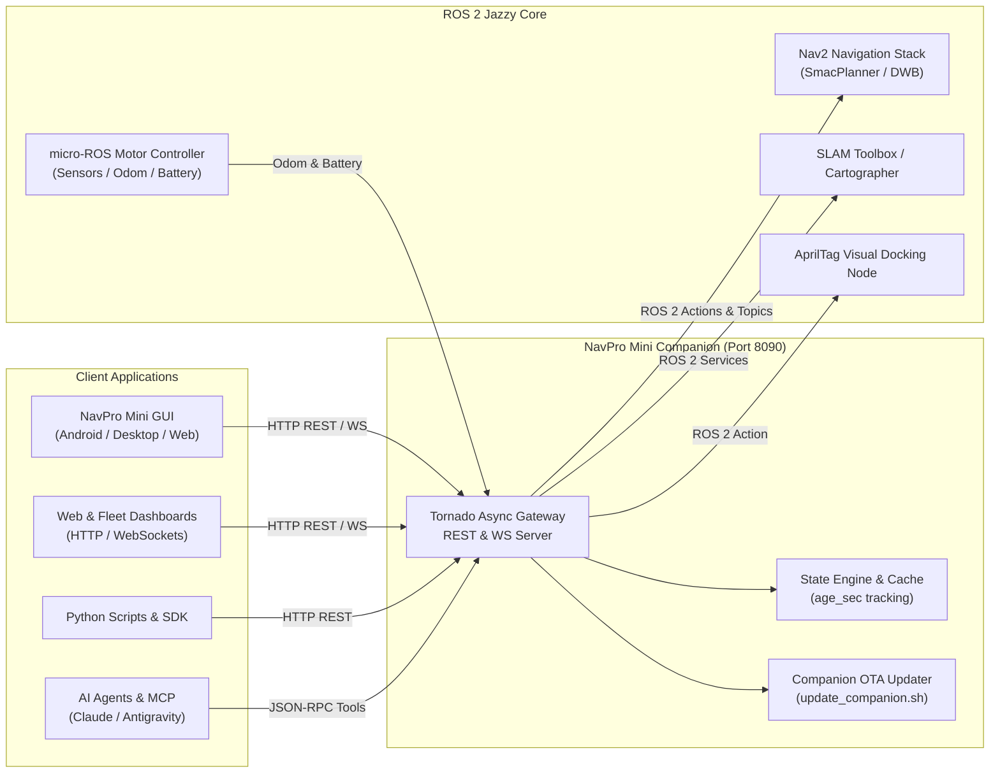

---
hide:
  - navigation
---

<style>
  /* Hide 'Edit this page' button on Home */
  .md-content__button {
    display: none !important;
  }
</style>

<div class="npm-hero" markdown>

<div class="npm-hero-pill">NAVPRO MINI &bull; ROBOTICS DEVELOPER PLATFORM</div>

# NavPro Mini SDK &amp; API

Programmatic control, SLAM mapping, autonomous navigation, visual docking, and real-time telemetry over plain HTTP &amp; WebSockets. Zero ROS installation required on client devices.

<div class="npm-hero-actions" markdown>
[:material-rocket-launch: Quick Start Guide](getting-started.md){ .md-button .md-button--primary }
[:material-api: REST API Reference](api/index.md){ .md-button }
[:material-lightning-bolt: Interactive OpenAPI Spec](reference.html){ .md-button }
[:material-robot: Python SDK &amp; MCP](clients.md){ .md-button }
</div>

</div>

<div class="npm-compat-card" markdown>

### :material-shield-check: Version &amp; Ecosystem Matrix

| Component | Active Version | Protocol / Stack | Verification Endpoint |
| :--- | :--- | :--- | :--- |
| **Documentation Portal** | **`v1.0.0`** | Guides &amp; OpenAPI 3.1 Spec | [API Overview](api/index.md) |
| **Robot REST API** | **`v1`** (`:8090/api/v1`) | HTTP JSON REST | `GET /api/v1/system/info` |
| **Telemetry Event Stream** | **`v1`** (`:8090/ws/telemetry`) | WebSocket 10 Hz Streams | [Events Guide](api/events.md) |
| **Robot Companion OS** | **`v1.0.0`** | Ubuntu 24.04 &bull; ROS 2 Jazzy | `GET /api/v1/system/updates` |
| **Mission Planner GUI** | **`v1.0.0`** | Android, Linux, Windows, Web | App **Settings &rarr; Help &amp; About** |

!!! tip "Verifying Version on Active Hardware"
    Check the active SDK and API version on your robot at any time:
    ```bash
    curl http://<robot-ip>:8090/api/v1/system/info
    ```
    Expected response:
    ```json
    {
      "robot": {"hostname": "navpromini", "model": "NavProMini"},
      "sdk_version": "1.0.0",
      "api_version": "v1",
      "capabilities": {"mapping": true, "navigation": true, "docking": true, "missions": true}
    }
    ```

</div>

## Try It in 10 Seconds

=== "HTTP REST (curl)"

    ```bash
    # 1. Read battery and charging status
    curl http://192.168.0.129:8090/api/v1/state/battery

    # 2. Dispatch robot to a saved waypoint
    curl -X POST http://192.168.0.129:8090/api/v1/navigation/navigate \
      -H "Content-Type: application/json" \
      -d '{"waypoint": "ChargingStation"}'

    # 3. Trigger autonomous AprilTag docking
    curl -X POST http://192.168.0.129:8090/api/v1/docking/dock
    ```

=== "Python SDK"

    ```python
    from navpromini import RobotClient

    # Connect to robot companion on local network
    client = RobotClient("http://192.168.0.129:8090")

    # Read live battery
    battery = client.get_battery()
    print(f"Battery: {battery.percentage}% (Charging: {battery.charging})")

    # Navigate to named waypoint
    client.navigate_to_waypoint("Lab_Desk_1")

    # Return to charging dock
    client.dock()
    ```

=== "WebSocket Stream"

    ```javascript
    // Stream live robot pose and battery at 10 Hz
    const ws = new WebSocket("ws://192.168.0.129:8090/ws/telemetry");

    ws.onmessage = (event) => {
      const msg = JSON.parse(event.data);
      console.log(`Pose: x=${msg.pose.x.toFixed(2)}, y=${msg.pose.y.toFixed(2)}, battery=${msg.battery.percentage}%`);
    };
    ```

=== "AI Agent (MCP Tools)"

    ```json
    // Model Context Protocol (MCP) tool invocation from Claude / Cursor / Antigravity
    {
      "tool": "navigate_to_waypoint",
      "arguments": {
        "waypoint_name": "Assembly_Line_B"
      }
    }
    ```

---

## Architecture

How the NavPro Mini SDK server bridges web applications and AI agents into native ROS 2:



---

## Core Capabilities

<div class="grid cards" markdown>

-   :material-clock-check:{ .lg .middle } **Timestamped Telemetry**

    ---

    Every telemetry reading carries an `age_sec` timestamp. You know instantly whether a reading is 10 ms fresh or stalled, preventing stale decision making in control loops.

    [:octicons-arrow-right-24: Telemetry &amp; State](api/state.md)

-   :material-map-marker-path:{ .lg .middle } **SLAM Mapping &amp; Navigation**

    ---

    Stream occupancy grid maps, activate saved environments, save named waypoints, and dispatch point-to-point or waypoint navigation goals with automatic path replanning.

    [:octicons-arrow-right-24: Navigation APIs](api/navigation.md)

-   :material-ev-station:{ .lg .middle } **Autonomous AprilTag Docking**

    ---

    Visual servoing precisely aligns the robot with its charging station using the onboard camera. Progress monitors physical contact switch state and battery charging voltage.

    [:octicons-arrow-right-24: Docking APIs](api/docking.md)

-   :material-format-list-checks:{ .lg .middle } **Sequenced Mission Engine**

    ---

    Compose and execute multi-step automated routines combining waypoints, coordinate moves, docking, delays, and audio/visual signals with failure recovery and cron scheduling.

    [:octicons-arrow-right-24: Mission APIs](api/missions.md)

-   :material-shield-alert:{ .lg .middle } **Safety &amp; Emergency Stop**

    ---

    Instant software emergency stop (`/api/v1/safety/estop`), obstacle avoidance costmaps, velocity limits, and battery low-voltage protective return-to-dock triggers.

    [:octicons-arrow-right-24: Safety &amp; Motion](api/motion.md)

-   :material-update:{ .lg .middle } **Detached Software Updates (OTA)**

    ---

    One-click companion package updates over REST API (`/api/v1/system/updates`) with preflight safety interlocks, atomic filesystem backup, and automatic compilation rollback.

    [:octicons-arrow-right-24: System &amp; Updates](api/system.md)

</div>

---

## API Quick Jump

<div class="md-typeset__table" markdown>

| Section | Endpoints | Key Resources |
| :--- | :--- | :--- |
| **[System &amp; Updates](api/system.md)** | `/system/info`, `/system/health`, `/system/updates` | Robot model, hardware telemetry, OTA update daemon |
| **[Robot State](api/state.md)** | `/state/pose`, `/state/battery`, `/state/imu`, `/state/scan` | Live positioning, power status, sensor telemetry with freshness |
| **[Maps &amp; Waypoints](api/maps.md)** | `/maps`, `/maps/active`, `/waypoints` | Map switching, occupancy grids, named navigation waypoints |
| **[Navigation](api/navigation.md)** | `/navigation/navigate`, `/navigation/status`, `/navigation/cancel` | Nav2 dispatch, goal tracking, ETA, and cancellation |
| **[Autonomous Docking](api/docking.md)** | `/docking/dock`, `/docking/undock`, `/docking/status` | AprilTag visual servoing and charger contact validation |
| **[Missions &amp; Schedules](api/missions.md)** | `/missions`, `/missions/{id}/execute`, `/schedules` | Multi-step task sequencer, loop routines, cron schedules |
| **[Real-time Events](api/events.md)** | `/ws/telemetry` | Low-latency 10 Hz WebSocket streaming |

</div>

---

## Ready to build?

<div class="grid cards" markdown>

-   :material-school:{ .lg .middle } **[Getting Started Tutorial](getting-started.md)**

    Follow the step-by-step tutorial to configure your environment and issue your first robot commands.

-   :material-code-json:{ .lg .middle } **[Interactive API Explorer](reference.html)**

    Explore and test every request schema, payload field, and response shape directly in Redoc.

-   :material-robot-outline:{ .lg .middle } **[Autonomous AI Agents &amp; MCP](clients.md)**

    Equip LLM assistants with 24 native robotic control tools using the Model Context Protocol.

</div>
