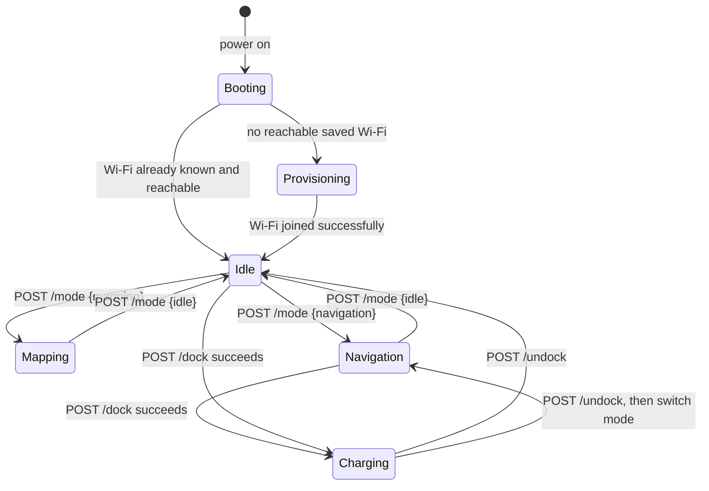

# Robot setup & lifecycle

Everything else in these docs assumes a robot that is already powered on and reachable on
your network. This page covers what happens *before* that — turning the robot on for the
first time, getting it onto your Wi-Fi, and the states it moves through afterward.

## 1. Power on

Press the robot's power button and give it a minute to boot. The robot's own status
display (OLED/LED) reflects what stage it is in — booting, waiting for Wi-Fi setup, ready,
mapping, navigating, or charging — so it is always worth a glance before reaching for a
laptop.

## 2. First-time Wi-Fi setup

A robot with no saved Wi-Fi network (or one that cannot see one it already knows) brings up
its own setup hotspot instead of sitting there unreachable:

| | |
|---|---|
| SSID | `NavPro-Setup-<id>` — unique per robot |
| Hotspot address | `10.42.0.1` |

**From the NavProMini app:** open Setup, and it will find and join a nearby `NavPro-Setup-*`
hotspot for you, then walk through picking your home network and entering its password.

**Without the app:** join `NavPro-Setup-<id>` manually from your phone or laptop's own Wi-Fi
settings, then open `http://10.42.0.1` in a browser. The same setup page comes up either
way — pick your network, enter the password, submit.

Once the robot successfully joins, it drops its own hotspot and continues booting onto your
network. From here, [Getting started](getting-started.md) picks up with finding its new IP
and talking to the SDK.

!!! tip "Wrong password, or the network moved out of range"
    The robot falls back to its own setup hotspot again rather than retrying forever
    against a network it cannot reach — join `NavPro-Setup-<id>` again to redo setup.

## 3. Lifecycle

The state a fresh robot moves through, end to end:

**Provisioning** and **Booting** are outside the SDK entirely — there is no HTTP endpoint
to observe them from, because the SDK itself is one of the things not running yet at that
stage. The robot's own status display is the only feedback available before it joins a
network.

From **Idle** onward, every state and transition in that diagram is exactly the SDK's own
`mode` concept, covered in full in [Core concepts → Modes are exclusive](concepts.md#modes-are-exclusive) —
this page just supplies the two stages that come before an SDK client can say anything at
all.

**Charging** is not a `mode` — it runs *underneath* whichever mode is active (see
[Docking success means charging](concepts.md#docking-success-means-charging)). A docked,
charging robot can still be told to undock and switch modes; the diagram above shows that
as a single conceptual step, but they are two separate calls
([`POST /undock`](api/docking.md), then [`POST /mode`](api/mode.md)).

---

**Next step**: Once your robot is connected to your Wi-Fi, proceed to [Getting started](getting-started.md) to discover its IP address, set up your `$ROBOT` environment variable, and send your first API calls.

