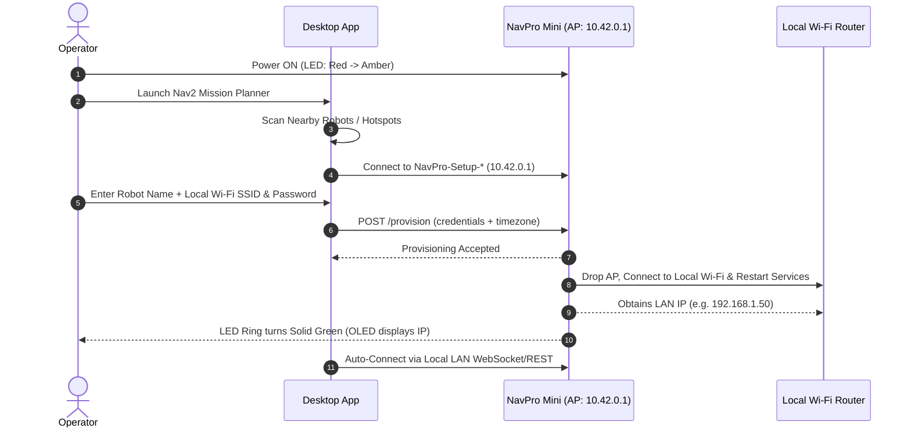
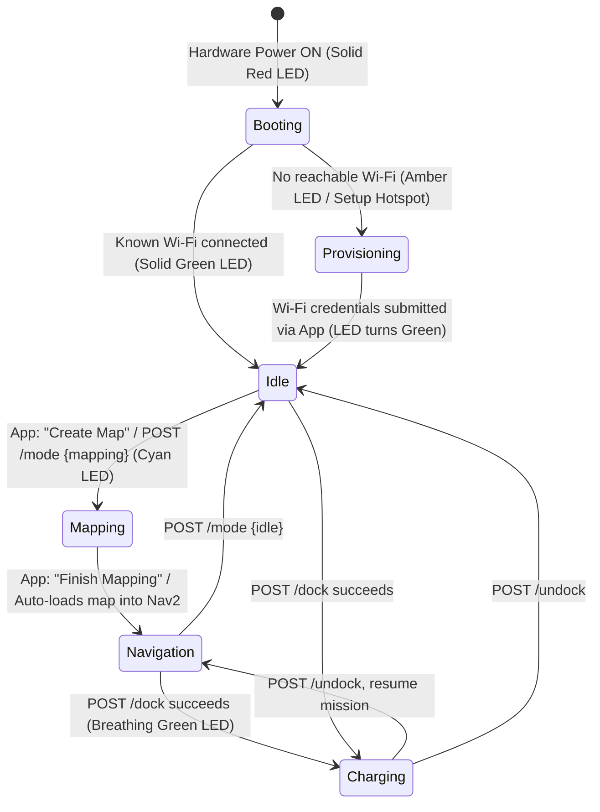

# Robot setup & lifecycle

Everything you need to go from unboxing your NavPro Mini AMR to driving autonomously in a mapped environment.

---

## 1. Unboxing & Hardware Power-On

### What's in the Box
- **NavPro Mini AMR** with 360° LiDAR, front sensor mast, rear AprilTag docking camera, and RGB status ring.
- **Autonomous Charging Dock Station** with AprilTag visual alignment target and spring-loaded charging contacts.
- **Power Adapter & Cable** (connect to the charging station).

### Station Placement
Place the charging dock flat against an open wall or solid vertical boundary. Ensure at least **1.5 meters of clear unobstructed floor space in front** of the dock so the robot can execute visual servoing and standoff staging maneuvers without obstacle interference.

### Powering On & LED Glow Status
Press and hold the power button on the robot's rear chassis. The circumferential RGB LED ring and onboard display reflect each initialization phase:

| LED Ring Glow | Robot State | Description |
|---|---|---|
| **Solid Red** | **Booting** | Microcontroller, single-board computer (SBC), and firmware drivers are powering on. |
| **Pulsing / Solid Amber (Orange)** | **Provisioning Mode** | No known Wi-Fi found. The robot broadcasts its own setup hotspot: `NavPro-Setup-<id>`. |
| **Solid Green** | **Idle / Ready** | Connected to your local Wi-Fi. ROS 2 nodes and SDK API daemon are live on port `8090`. The OLED display shows the assigned IP address. |
| **Cyan / Pulsing Blue** | **Mapping / Active Navigation** | LiDAR SLAM active, or autonomous path planning to a goal/waypoint underway. |
| **Breathing Green** | **Docked & Charging** | Charging pins engaged, battery management system (BMS) accepting charge current. |

---

## 2. Wi-Fi Setup via Nav2 Mission Planner Desktop App

The recommended way to configure Wi-Fi and commission the robot is via the cross-platform desktop application:

👉 **[Nav2 Mission Planner GUI (`navpro-mini` branch)](https://github.com/botforge-robotics/nav2_mission_planner_gui/tree/navpro-mini)**  
*(Cross-platform Flutter application supporting Linux desktop, Windows, and Android).*

### Step-by-Step Commissioning
1. **Launch the App**: Open **Nav2 Mission Planner** on your PC.
2. **Find Nearby Robot**:
   - On the setup screen, the app scans for nearby robots.
   - If the robot has no Wi-Fi saved, select **"Set up a new robot"**. The app will detect the broadcasted `NavPro-Setup-*` hotspot.
   - *(Alternatively, manually connect your PC/phone Wi-Fi to `NavPro-Setup-<id>`, where the setup portal is accessible at `http://10.42.0.1`).*
3. **Fill in Details**:
   - Choose or enter your local Wi-Fi **SSID** and **Password**.
   - Assign a friendly **Robot Name** (e.g., `navpro-mini-01`).
   - Click **Submit**.
4. **Automatic Restart & Connection**:
   - The robot stores the credentials and restarts its network subsystem.
   - Once connected to your local network, the LED ring transitions to **Solid Green**, and the onboard OLED screen displays its assigned local IP address.
   - The desktop app detects the newly commissioned robot and transitions to the main Dashboard.

---

## 3. Creating Your First Map in the App

Before autonomous navigation can occur, the robot must map its physical operating environment.

1. **Place Robot at the Charger**:
   Before initiating mapping, place the robot directly against its charging station facing outward. Wherever mapping starts becomes the origin $(0, 0, 0)$ coordinate frame of the new map.
2. **Start Mapping Session**:
   In the desktop app, navigate to **Maps** and click **Create Map** (or select **Mapping Mode**). This starts the SLAM mapping stack (`POST /mode {"mode": "mapping"}`).
3. **Drive to Map the Environment**:
   Use the on-screen virtual joystick or teleoperation pad to drive the AMR through every room, corridor, and aisle. Watch the 2D LiDAR occupancy grid expand in real-time on the map canvas.
4. **Finish & Save the Map**:
   Once all walls, borders, and obstacles are cleanly resolved, click **Finish Mapping** and assign a name (e.g., `warehouse_floor1` or `lab_room`).
5. **Atomic Navigation Auto-Load**:
   The robot automatically saves the map, serializes the pose graph, terminates SLAM, **loads the newly saved map into the Nav2 stack, and transitions directly into Navigation mode**. You do not need to restart the robot or manually trigger mode changes.

---

## 4. Verifying & Adjusting the Dock Pose

Reliable autonomous docking requires the software dock coordinates to match the physical charging base:

1. **Open Dock Position Editor**:
   In the desktop app, navigate to **Dock & Charge** $\rightarrow$ **Edit Dock Pose** (or tap the Dock icon ⚡ on the live map).
2. **Dual-Marker Alignment**:
   The editor displays two linked markers on your map:
   - **Dock Marker (⚡)**: The physical contact pose where the robot's rear charging pads engage.
   - **Standoff Marker (🎯)**: The approach staging pose (~0.6m in front of the dock, facing away).
3. **Fine-Tuning**:
   - Drag markers or use the **5mm precision micro-adjustment buttons** to nudge the coordinates.
   - Heading vectors are automatically maintained between the dock and standoff points.
4. **Save**: Click **Save Dock Pose**. The coordinates are written to persistent storage (`PUT /dock/pose`).

---

## 5. Next Steps: Two Paths Forward

Once your map is active and the dock pose is calibrated, you are ready to operate:

### Path A: Operate Inside the Desktop App
Continue using the visual interface of [Nav2 Mission Planner GUI](https://github.com/botforge-robotics/nav2_mission_planner_gui/tree/navpro-mini):
- **Add Locations**: Tap any point on your map to save named landmarks (e.g., `kitchen`, `station_a`, `pickup`).
- **Mission Planner**: Chain waypoints, pauses, and actions into multi-step patrol routes using the visual drag-and-drop editor.
- **Mission Scheduler**: Set recurring alarm-style schedules (daily, weekly, or one-time runs) directly from the app bar.

### Path B: Automate via Plain APIs, Python SDK, or MCP Server
If you are building custom software, fleet managers, or AI agent integrations:
- **REST & WebSocket API**: Proceed to [**Getting started**](getting-started.md) to discover endpoints and execute curl commands using the `$ROBOT` environment variable.
- **Official Python SDK**: Install `pip install -e clients/python` and control the robot with Python ([Clients & Recipes](clients.md)).
- **Model Context Protocol (MCP)**: Hook into LLMs (Google Antigravity, Gemini, Cursor) to enable natural language autonomous mission dispatch ([MCP Server Guide](mcp.md)).

---

## 6. Complete System Lifecycle

---

**Next step**: Proceed to [Getting started](getting-started.md) to query your robot from the command line, verify API communication, and run your first autonomous navigation goals.
